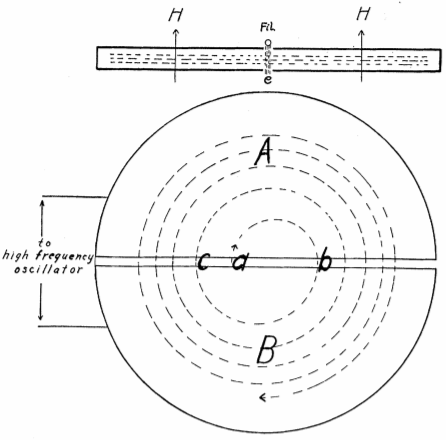
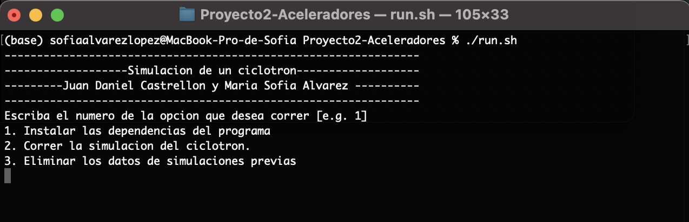

## Aceleradores de Partículas y sus Aplicaciones
### Proyecto 2: Ciclotron
> Elaborado por: Juan Daniel Castrellón Botero (201729285) y María Sofía Álvarez López (201729031)}

  <h4>
    <a href="#intro">
      Introducción al proyecto
    </a>
     | 
    <a href=#correr>
      Correr el proyecto
    </a>
  </h4>

<h2 name="intro">Introducción al proyecto</h2>

 
El objetivo de este proyecto fue el de simular la trayectoria de un protón acelerado en un ciclotrón a una energía de 200MeV. De esta forma, se quería verificar propiedades importantes para el funcionamiento del dispositivo, como el que se mantenga el periodo constante a lo largo del tiempo, además, de visualizar la trayectoria que sigue la partícula, el espacio de fase y su radio calculado de dos formas distintas. De esta manera, se creó un programa en python el cual simula un protón que entra en un ciclotrón y que se acelera a una cierta energía $E_max$

El ciclotrón es una máquina propuesta por Ernest Lawrence, la cual tiene como objetivo el acelerar iones a altas energías haciendo uso de voltajes pequeños. En si, el diseño está compuesto por dos semicírculos en los cuales hay un campo magnético constante perpendicular al plano de los semicírculos. Asimismo, el espacio entre las dos regiones con forma de D se encuentra un campo eléctrico conectado a una fuente AC, el cual se encarga de aumentar la energía de las partículas.

El programa hace uso del método de verlet con el fin de simular una protón que entra dentro de un ciclotrón. Esta partícula seguirá movimientos circulares en la región con form de D, con una frecuencia w = B|q|/m. De esta forma, se construye una región con campo electrico oscilante a una frecuencia w_osc. La idea es entonces que w_osc = w, lo cual permite que el protón encuentre el campo en la dirección que necesita para acelerarse.

<h2 name="correr">Correr el proyecto</h2>

 
  Con el fin de correr este repositorio, deben seguirse los pasos mostrados a continuación. 

<ol>
<li> Antes de correr el proyecto, asegúrese de tener instalado <code>python3</code> en su máquina local y <code>pip</code> o <code>pip3</code> para instalar las dependencias y librerías necesarias para la ejecución del programa. Si no cuenta con alguno de estos, puede instalarlos remitiéndose a <a href=https://www.python.org/downloads/>la documentación oficial de python</a> para instalar <code>python3</code>, con lo que se instalará una distribuión de <code>pip</code></li>
<li> Corra el archivo <code>./run.sh</code>. En caso de que le salga el error <i>Permission denied</i> ejecute alguno de los comandos mostrados a continuación.
  <ul>
    <li><code>sudo ./run.sh</code></li>
    <li><code>chmod 777 ./run.sh</code></li>
  </ul>
  Lo cual dará los permisos de ejecución necesarios para correr el programa.
</li>
<li>Una vez corrido el programa, se le mostrarán las opciones disponibles:
    <ol>
    <li>Instalar las dependencias y librerías del programa.</li>
    <li>Correr la simulacion</li>
     <li>Eliminar los datos de las simulaciones previas.</li>
  </ol>
  <b>NOTA:</b>Para correr la última opción, debe haberse ejecutado al menos una vez la parte 1 del proyecto.
  Como se ve en la imagen mostrada a continuación,
   

  
  

  <i>NOTA: Si es la primera vez que corre el programa, seleccione la opción 1.</i> 
  Otra forma de instalar las dependencias es corriendo el comando <code>pip install -r requirements.txt</code>
</li>

<li><h3 name="correr-parte-1">Correr la simulación: </h3>
  Si desea correr la simulacion, seleccione la segunda opción del archivo <code>./run.sh</code>. Aquí, se le solicitarán algunos datos con el fin de correr la simulación. 
  <ol>
    <li> Primero, deberá ingresar el voltaje en voltios máximo. </li>
    <li> Después, deberá ingresar la velocidad máxima, en m/s, que una partícula debe tener. Esta velocidad se multiplica por un número aleatorio entre 0 y 1 con el fin de generar partículas con diferentes velocidades (y momentos) iniciales. </li>
    <li> Más adelante, deberá ingresar la magnitud del campo magnético B, en Tesla, que existirá en el espectrómetro de momentos. </li>
    <li> Finalmente, deberá ingresar el paso temporal con el que desea realizar la simulación. Se recomiendan pasos temporales menores a <i>0.0001 s</i> con el fin de tener resultados precisos.  </li>
  </ol>
  Si es la primera vez que se corre la simulación, se genera la carpeta <code>datos</code>, donde, por cada vez que se ejecuta el programa, se almacenan los datos de la simulación en una carpeta con la fecha en que se inició la simulación. Por ejemplo: <code>2020-11-05 16:56:29.880790</code> es una simulación que se inició el 5 de noviembre a las 16:56 horas. 
  Dentro de cada carpeta de simulación, se pueden encontrar los siguientes archivos y carpetas:
  <ul>
    <li>Carpeta <code>trayectorias</code>: Almacena, en un archivo por partícula, las posiciones x,y,z, en cada momento del tiempo, de cada una de las partículas simuladas.   Se generan tantos archivos como partículas se hayan simulado.   El formato del archivo es: <code>x,y,z</code> y se almacena como <code>i.dat</code> donde <code>i</code> es el número de la partícula simulada.</li>
    <li>Archivo <code>x_finales.dat</code>: Almacena las posiciones finales, en x, de cada una de las partículas.   El formato del archivo es: <code>id_particula,x_final</code></li>
    <li>Archivo <code>momentos.dat</code>: Almacena el momento inicial y final de cada partícula, calculados como p = qv y p = qBR, respectivamente.   El formato del archivo es: <code>id_particula,x_inicial_x_final</code></li>
    <li>Imagen <code>trayectorias.png</code>: Muestra gráficamente las trayectorias de cada una de las partículas simuladas en el espectrómetro de momentos. Dos imágenes ejemplo generadas con 5 y 100 part se muestran a continuación,
      
Para 5 partículas:

      

       
      

      
Para 100 partículas:

      

       
      

    </li>
    <li>Imagen <code>momentos.png</code>: Muestra el momento final de una partícula en función de su momento inicial y realiza un ajuste lineal entre ambas cantidades. Una imagen ejemplo generada con 100 partículas, con un paso temporal de 1 microsegundo, se muestra a continuación,
      

       
      

    </li>
    <li>Imagen <code>error_momento.png</code>: Muestra el error en el momento (calculado como |p_final - p_inicial|) en función del momento inicial de las partículas. Entre más grande sea el paso temporal y/o la velocidad de las partículas, se espera un mayor error. Una imagen ejemplo generada con 100 partículas, con un paso temporal de 1 microsegundo, se muestra a continuación,
      

       
      

</li>
  </ul>
  Asimismo, dentro de la carpeta <code>datos</code>, se genera un archivo <code>errores.dat</code>, con el formato <code>delta_tiempo,error_maximo,error_medio</code>, donde <code>delta_tiempo</code> corresponde al paso temporal usado en una simulación y <code>error_maximo</code> y <code>error_medio</code> el error más alto y el error promedio en el momento p, calculado como |p_final - p_inicial|, de cada simulación. Cada vez que se corre una simulación, se agregan estos datos a dicho archivo.  
  Con los datos de este archivo, corriendo el script <code>grafica_errores.py</code>, o ejecutando la opción 4 del script <code>./run.sh</code>, se genera la gráfica mostrada a continuación,
        

       
      

  Esta permite visualizar el error en el momento según el paso temporal utilizado en la simulación. Esta gráfica se almacena en la ruta <code>datos/error_momento_tiempo.png</code>.  
  <b>NOTA:</b> Para correr esta opción, es necesario haber corrido, por lo menos, dos veces la simulación de la parte 1 con diferentes pasos temporales. 
  </li>
