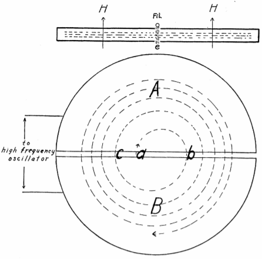
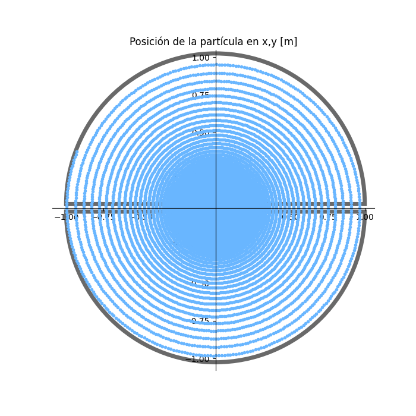
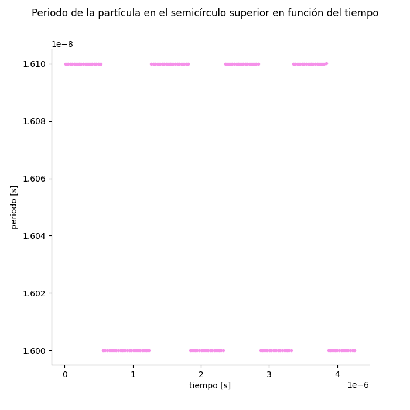
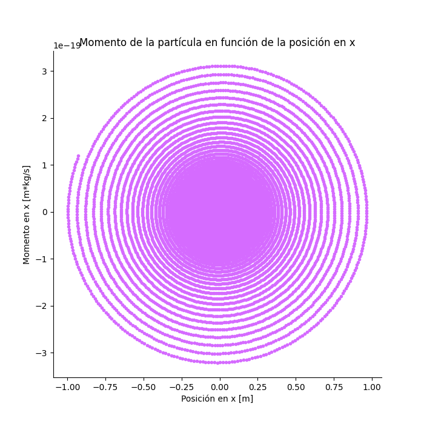
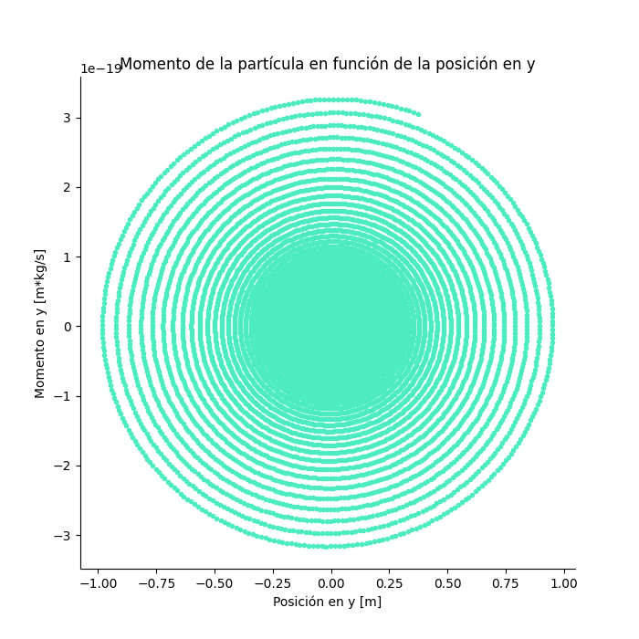
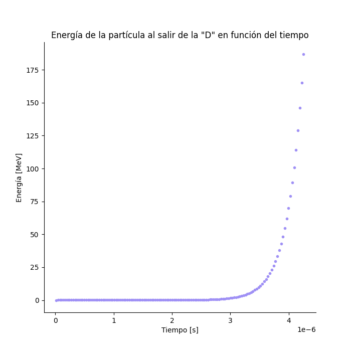
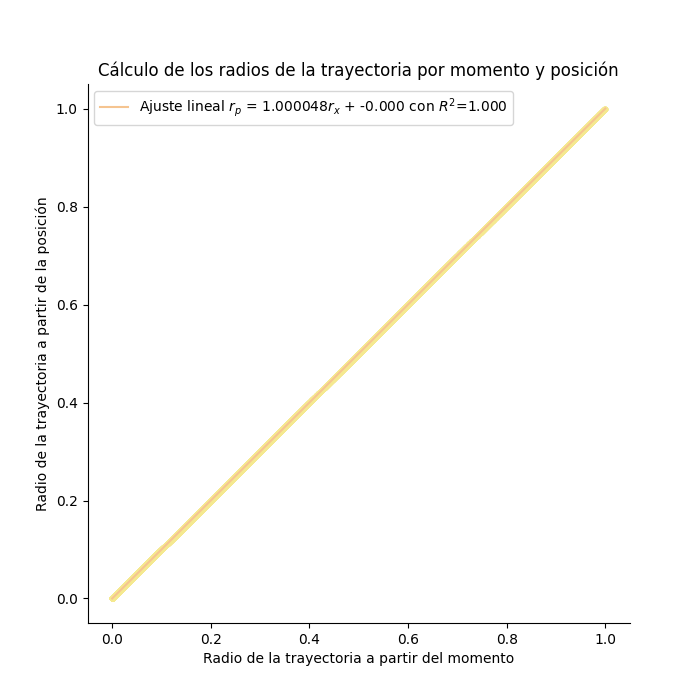
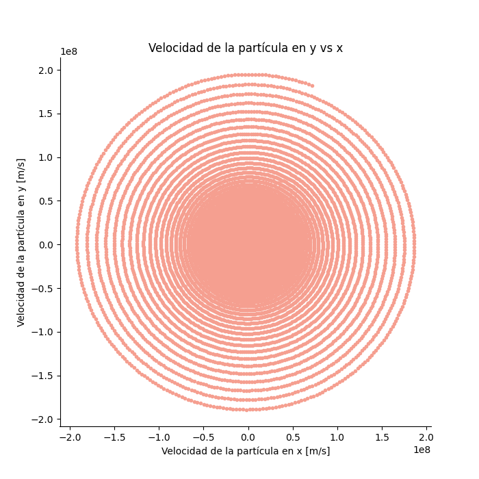

## Aceleradores de Partículas y sus Aplicaciones
### Proyecto 2: Ciclotron
> Elaborado por: Juan Daniel Castrellón Botero (201729285) y María Sofía Álvarez López (201729031)}

  <h4>
    <a href="#intro">
      Introducción al proyecto
    </a>
     | 
    <a href=#correr>
      Correr el proyecto
    </a>
  </h4>

<h2 name="intro">Introducción al proyecto</h2>

 
El objetivo de este proyecto fue el de simular la trayectoria de un protón acelerado en un ciclotrón a una energía de 200MeV. De esta forma, se quería verificar propiedades importantes para el funcionamiento del dispositivo, como el que se mantenga el periodo constante a lo largo del tiempo, además, de visualizar la trayectoria que sigue la partícula, el espacio de fase y su radio calculado de dos formas distintas. De esta manera, se creó un programa en python el cual simula un protón que entra en un ciclotrón y que se acelera a una cierta energía $E_max$

El ciclotrón es una máquina propuesta por Ernest Lawrence, la cual tiene como objetivo el acelerar iones a altas energías haciendo uso de voltajes pequeños. En si, el diseño está compuesto por dos semicírculos en los cuales hay un campo magnético constante perpendicular al plano de los semicírculos. Asimismo, el espacio entre las dos regiones con forma de D se encuentra un campo eléctrico conectado a una fuente AC, el cual se encarga de aumentar la energía de las partículas.

El programa hace uso del método de verlet con el fin de simular una protón que entra dentro de un ciclotrón. Esta partícula seguirá movimientos circulares en la región con form de D, con una frecuencia w = B|q|/m. De esta forma, se construye una región con campo electrico oscilante a una frecuencia w_osc. La idea es entonces que w_osc = w, lo cual permite que el protón encuentre el campo en la dirección que necesita para acelerarse.

<h2 name="correr">Correr el proyecto</h2>

 
  Con el fin de correr este repositorio, deben seguirse los pasos mostrados a continuación. 

<ol>
<li> Antes de correr el proyecto, asegúrese de tener instalado <code>python3</code> en su máquina local y <code>pip</code> o <code>pip3</code> para instalar las dependencias y librerías necesarias para la ejecución del programa. Si no cuenta con alguno de estos, puede instalarlos remitiéndose a <a href=https://www.python.org/downloads/>la documentación oficial de python</a> para instalar <code>python3</code>, con lo que se instalará una distribuión de <code>pip</code></li>
<li> Corra el archivo <code>./run.sh</code>. En caso de que le salga el error <i>Permission denied</i> ejecute alguno de los comandos mostrados a continuación.
  <ul>
    <li><code>sudo ./run.sh</code></li>
    <li><code>chmod 777 ./run.sh</code></li>
  </ul>
  Lo cual dará los permisos de ejecución necesarios para correr el programa.
</li>
<li>Una vez corrido el programa, se le mostrarán las opciones disponibles:
    <ol>
    <li>Instalar las dependencias y librerías del programa.</li>
    <li>Correr la simulacion</li>
     <li>Eliminar los datos de las simulaciones previas.</li>
  </ol>
  <b>NOTA:</b>Para correr la última opción, debe haberse ejecutado al menos una vez la parte 1 del proyecto.
  Como se ve en la imagen mostrada a continuación,
   

  
  

  <i>NOTA: Si es la primera vez que corre el programa, seleccione la opción 1.</i> 
  Otra forma de instalar las dependencias es corriendo el comando <code>pip install -r requirements.txt</code>
</li>

<li><h3 name="correr-parte-1">Correr la simulación: </h3>
  Si desea correr la simulacion, seleccione la segunda opción del archivo <code>./run.sh</code>. Aquí, se le solicitarán algunos datos con el fin de correr la simulación. 
  <ol>
    <li> Primero, deberá ingresar el voltaje en voltios máximo. </li>
    <li> A continuación, se debe introducir el radio del ciclotron en metros </li>
    <li> Luego, es necesario poner el parámetro de la distancia entre las D's en metros </li>
    <li> Por último, se introduce la energía que desea que la partícula alcance </li>
  </ol>
  Si es la primera vez que se corre la simulación, se genera la carpeta <code>simulacion</code>, donde, por cada vez que se ejecuta el programa, se almacenan los datos de la simulación en una carpeta con la fecha en que se inició la simulación. Por ejemplo: <code>2020-12-14 16:56:29.880790</code> es una simulación que se inició el 14 de diciembre a las 16:56 horas. 
  Dentro de cada carpeta de simulación, se pueden encontrar los siguientes archivos y carpetas:
  <ul>
    <li> Archivo de datos <code>E_v.dat</code>: Almacena los valores MagintudCampoElectrico, Diferencia MagnitudActual-MagnitudTotal(E0), MagnitudTotal(E_0), VelocidadY. Donde, se almacenan estos valores para cada vez que la partícula pase de la D superior a la inferior.
    <li>Imagen <code>trayectoria_ciclotron.png</code>: Muestra gráficamente las trayectorias de la partícula simulada en el ciclotrón. Un ejemplo de una partcula que se acelera a 200MeV en un ciclotrón de radio 1 con un espacio entre las D's de 0.05 y voltaje de 110V.
      

       
      

      
Para 100 partículas:

    </li>
    <li>Imagen <code>periodo_vs_tiempo.png</code>: Muestra el tiempo que tarda la partícula en recorrer la parte superior del ciclotron para cada momento de tiempo que dura la simulación
      

       
      

    </li>
    <li>Imagen <code>px_vs_x.png</code>: Muestra el espacio de fase de las partículas en X. en el eje de las Y se encuentra el momento y en en el de las X la posición en X.
      

       
      

    </li>
    <li>Imagen <code>py_vs_y.png</code>: Muestra el espacio de fase de las partículas en Y. en el eje de las Y se encuentra el momento y en en el de las X la posición en Y.
      

       
      

    </li>
    <li>Imagen <code>energia_tiempo</code>: Muestra como aumenta la energia en funcion del tiempo. La energía es tomada cada vez que la partícula da una vuelta en el ciclotron.
      

       
      

    </li>
    <li>Imagen <code>r_xy_vs_r_momento.png</code>: Muestra el radio de la trayectoria de la partícula calculado de dos formas diferentes. El primero es usando r=sqrt(x^2+y^2) y el segundo como r=p/Bq. Como se ve en la imagen, ambas formas son consistentes, y generan una recta con pendiente 1, lo cual indica que el método usado es bueno
      

       
      

    </li>
    <li>Imagen <code>vy_vx.png</code>: Muestra una gráfica de las velocidades en Y y en X para la partícula en el ciclotron
      

       
      

    </li>
    <li>Video <code>ciclotron.mp4</code>: Una simulación de la partícula dentro del ciclotron en formato mp5
      

       <video src="imagenes/ciclotron.mp4" width=320  height=240 controls poster="vistaprevia.png">
Video del ciclotron
</video>
      

    </li>
  </ul>
  </li>
